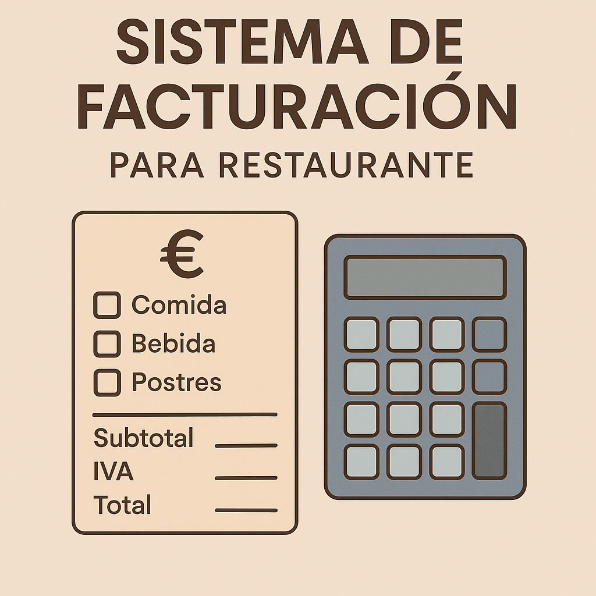
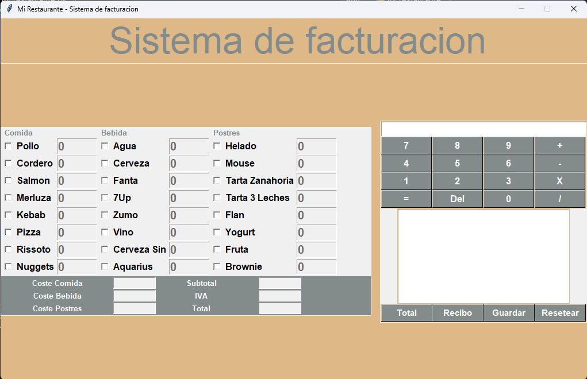
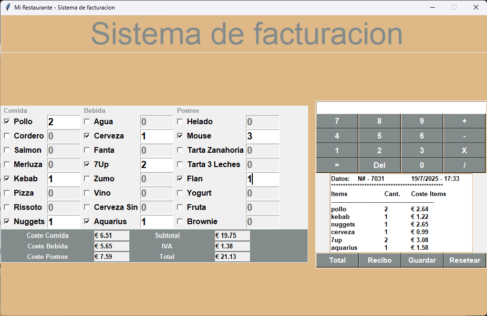
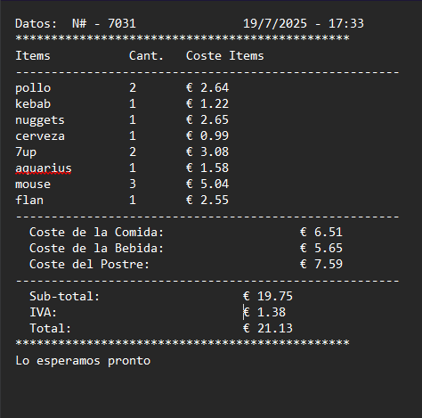

# 🧾 Sistema de Facturación para Restaurante - Tkinter

Este proyecto es una aplicación de escritorio construida con Python y Tkinter. Permite gestionar pedidos de comida, bebida y postres, calcular costos y generar recibos de forma sencilla.

## 🚀 Características principales

- Interfaz gráfica con botones, campos de entrada y menú
- Calculadora integrada
- Paneles para comida, bebida y postres
- Generación automática de recibo
- Funciones de guardar, resetear y salir
- Estructura modular y lista para ampliaciones

## 🖼️ Vista previa

### 🧾 Panel Principal

### 📊 Cálculo de Costes

### 🧾 Recibo generado

## 🔧 Requisitos

- Python 3.x

## ▶️ Ejecutar la aplicación

python main.py

## 👨‍💻 Autor
**David Suárez**
[GithHub](https://github.com/scod01)
[LinkedIn](https://www.linkedin.com/in/davidsuarez-dev)

¡Gracias por visitar este proyecto! Si te ha gustado, no olvides dejar una ⭐ en el repositorio.
